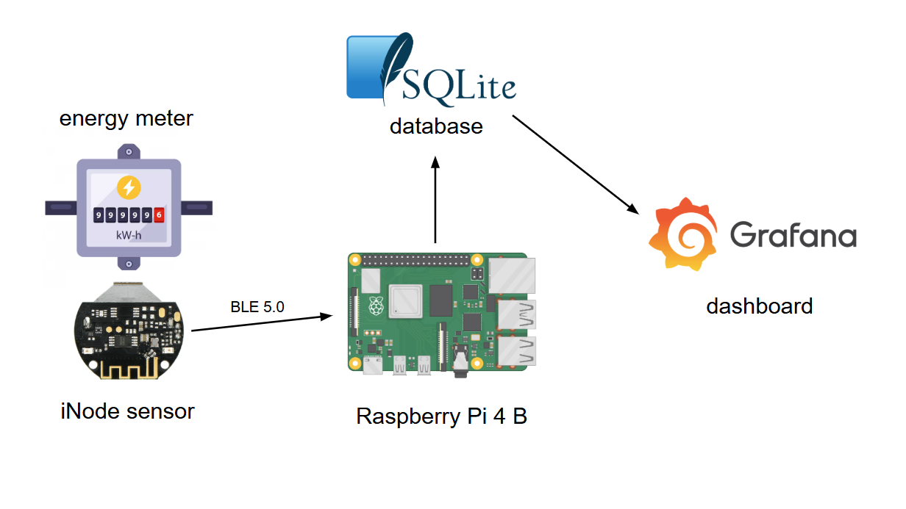
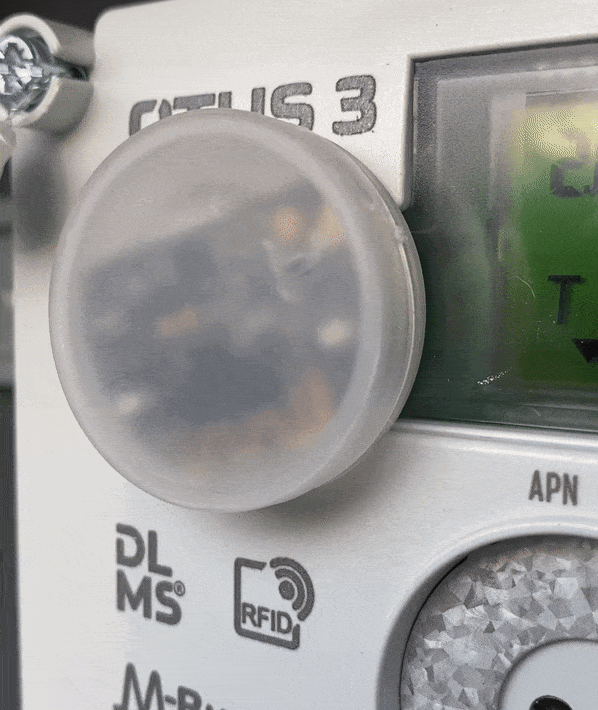
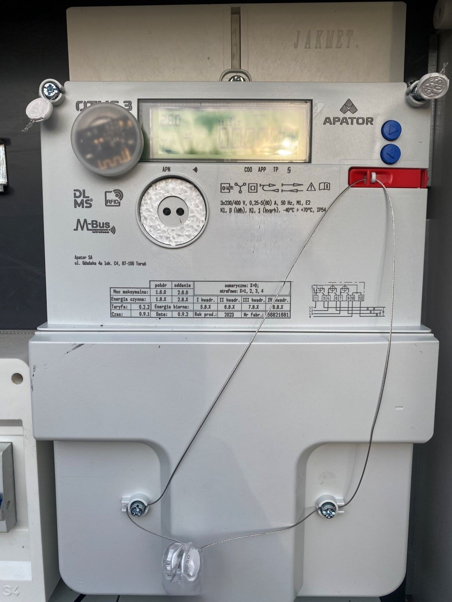

# 🔋 Energy Meter Project

## Introduction

The **Energy Meter** project monitors home energy consumption using a Bluetooth Low Energy (BLE) sensor iNode. The sensor is mounted on your home's energy meter and uses a photoresistor to count the number of LED blinks. Based on the energy meter constant (e.g. 2500 impulses per kWh) and the number of recorded impulses, energy usage is calculated. The data is sent via Bluetooth to a Raspberry Pi, where ETL (Extract, Transform, Load) processes are handled by scripts. The processed data is stored in an SQLite database and visualized through a Grafana dashboard.



<br>

## iNode Energy Meter Sensor

- The iNode energy meter is a simple but robust sensor that uses a photoresistor to detect blinking LED located on the case of an energy meter, which represents energy usage in real-time.
- You need to attach the sensor with the photoresistor positioned directly above the blinking LED. Once attached, the sensor will record all the blinks and distribute the data using BLE.

<figure>

<figcaption><i>The blinking LED on the energy meter and the blinking LED on the sensor indicate that the sensor is recording data</i></figcaption>
</figure>

<br>

- The sensor is powered by an ordinary CR2032 battery, which can last for up to a year. In my case, the energy meter is mounted in a box outside my house, operating in a temperature range from -20°C to 35°C. Over the past year, I have had no issues with the sensor, which reliably sends data every 5 minutes. The Bluetooth range is decent, and the signal successfully passes through the wooden wall to reach the Raspberry Pi in my homelab.
- Knowing the constant of the energy meter (usually written on the case, e.g. 2500 impulses per 1 kWh), we can convert the number of impulses into power usage. The sensor counts both the total number of impulses from the very beginning and the number of impulses in the last minute. This allows us to calculate both instantaneous power and total energy usage.
- I strongly recommend this device. It's not cheap (I paid around 30 euros a year ago), but it's well worth the price. Here is a link to [documentation](https://support.inode.pl/docs/iNode%20Energy%20Meter%20-%20instrukcja.pdf) (in Polish only).
  
<br>

To use the iNode BLE energy meter sensor, follow the steps below:

**Installing the Sensor**  
The first step is to mount the sensor on the energy meter based on the manual and check the blinking LED on the sensor, which indicates that it reads the impulses from the energy meter's LED.

<figure>

<figcaption><i>Energy meter with iNode sensor mounted</i></figcaption>
</figure>

<br>

**Installing Required Packages**   
On the device with BT 5.0 (Raspberry Pi in my case) which will be receiving the data from the iNode sensor, update the package list and install the necessary packages on Linux (Ubuntu):
```sh
sudo apt-get update
sudo apt-get install sqlite3 libbluetooth-dev python3-venv
```

**Testing Connection**  
Run the following command to test the connection to the sensor:
```sh
sudo bash scan_bt.sh
```

This command should output two integer values: the total number of impulses recorded and the number of impulses in the last minute.

<br>

## Installation

Create a virtual environment and activate it:
```sh
python3 -m venv venv
source venv/bin/activate
```

Install Python dependencies from the `requirements.txt` file:
```sh
pip install -r requirements.txt
```

Create the SQLite database based on the schema from the script:
```sh
sqlite3 energy_meter.db < schema.sql
```

**Configure Environment Variables**  
Make sure to update the `.env` file based on `.env.example` with the correct paths to the SQLite database, logging location, and other configuration variables.

<br>

## Usage

Recording the data from the iNode sensor is pretty simple. There are two main scripts:
- `scan_bt.sh` - a shell script for Bluetooth communication to retrieve raw data from the sensor.
- `energy_meter_cron.py` - a Python script run as a cron job that handles data extraction, transformation, and loading into the SQLite database.

**Set Up a Cron Job**  
To run the `energy_meter_cron.py` script every 5 minutes as a cron job, add the following line to your crontab (`crontab -e`):
```
*/5 * * * * /path/to/venv/bin/python /path/to/energy_meter_cron.py >> /path/to/log/cron.log 2>&1
```
You can adjust the time interval as needed.

**Checking SQLite Data and Logs**  
After setting up the cron job, check the database and logs to ensure data is being stored correctly.

To check the data in the SQLite database, use:
```sh
sqlite3 energy_meter.db "SELECT * FROM energy_meter;"
```

Check the logs to monitor errors or other information:
```sh
tail -f /path/to/log/energy_meter.log
```

<br>

## Dashboard


The second part of this project is a dashboard that visualizes the data stored in the SQLite database, providing real-time energy consumption insights. While many tools can be used, I chose **Grafana** for its compatibility with SQLite and its ability to create complex dashboards.

In the `/grafana` folder, you will find detailed instructions on how to install Grafana on Linux (Ubuntu) and import my dashboard configuration.

Alternatively, you can use any tool to visualize data from the SQLite database. For a long time, I used Jupyter Notebook along with the `matplotlib` library for energy consumption analysis. 😎 

<br>

## Additional Information

- Ensure that the Bluetooth is enabled on your Raspberry Pi to communicate with the iNode sensor.
- Using SQLite for data storage has significant advantages over CSV files, such as enabling easy data querying with the `sqlite3` command-line tool.
- The `energy_meter_cron.py` script handles data synchronization with a remote database using `rsync`, which helps to keep a backup copy of the local SQLite database.  If you don't want to use that function just simply comment it in the `main()` function.

Feel free to contribute or suggest improvements to the project by opening issues or submitting pull requests 😃
